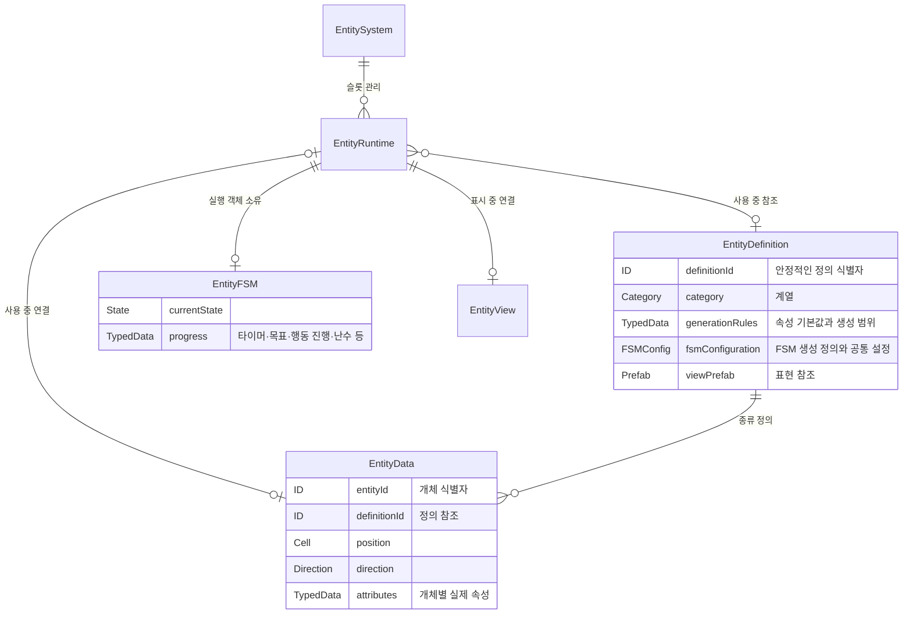

# 중요 설계 결정

## DEC-011 — Tool 재선택 해제와 SelectMode의 편집 확인 행

- **상태:** Active
- **결정:** Palette에서 이미 활성화된 Entity·Terraform·Road 항목을 다시 선택하면 Active Tool을 해제한다. 현재 Category는 유지하고 일반 Cell 선택으로 돌아간다. 도구 변경·해제에 따른 Pending 취소는 기존 Input 경로를 사용한다.
- **편집 확인:** Clear Tool 버튼을 제거하고 같은 여백·행 높이에 취소 / 적용 버튼을 가로로 배치한다. 기존 WorldEditConfirmationView와 실행·취소 경로를 재사용하며 화면 위치를 따라다니는 확인 Panel은 사용하지 않는다. 대기 상태가 아니면 두 버튼을 비활성화하고, 취소는 Pending만 해제하여 Active Tool을 유지한다. 적용은 유효한 Pending에만 허용한다.
- **모드별 크기:** Brush Size는 Brush에서만 표시하며 해당 행과 간격만큼 SelectMode Palette 높이를 확장한다. Single·Area에서는 행을 숨기고 빈 공간을 줄인다. Palette 상단·폭과 Workspace 크기는 유지하고 확인 버튼 행은 Palette 하단을 따른다.
- **대체 범위:** DEC-010의 SelectMode 고정 높이 해석을 대체한다. 독립 Box, Simulation·Inspector 배치 및 도메인 상태 분리 결정은 유지한다.

## DEC-010 — 독립 SelectMode Palette와 우측 Box의 연동 배치

- **상태:** Active
- **후속 변경:** SelectMode의 모드별 높이와 편집 확인 행은 DEC-011을 따른다. 아래 고정 크기 문구는 해당 부분에 한해 Superseded이다.
- **대체 범위:** DEC-009 중 Workspace 내부 SelectMode 공간, Simulation의 별도 Launcher, 우측 Box의 고정 위치 결정을 대체한다. 나머지 Context·상태 소유권·입력 규칙은 유지한다.
- **결정:** SelectMode Palette는 Canvas 직속의 독립 Box로 Workspace 아래에 배치한다. Active Tool이 있을 때만 Box 전체를 표시하며 빈 안내 영역을 남기지 않는다. Workspace 축소로 Active Tool이나 SelectMode Palette를 해제하지 않는다. 두 Box의 크기는 도구 활성 여부에 따라 재조정하지 않는다.
- **Simulation:** 축소 시 폭과 상단 위치를 유지하고 높이만 줄인다. X와 동일한 위치·크기의 확대 버튼을 표시하며 간결한 필수 정보는 유지한다. 표시 변화가 Simulation 실행 상태를 변경하지 않는다.
- **시작 상태:** 확장·축소 가능한 Workspace·Simulation·Inspector는 모두 축소 상태로 시작한다. 이후 사용자의 표시 상태는 재활성화 시 유지하며 영구 저장하지 않는다. SelectMode Palette는 기존 Active Tool 유무에 따른 표시 규칙을 유지한다.
- **Inspector:** 확장 영역과 축소 시 확대 버튼 모두 Simulation 아래에 동일한 간격으로 배치한다. Simulation 높이가 변하면 함께 이동하며 Inspector 자체의 확장·축소 상태와 선택 Context는 유지한다.
- **영향 시스템:** Main Scene의 직렬화 UI 배치, MainSceneUIView의 표시 제어. World·Simulation 도메인과 저장 형식은 변경하지 않는다.

## DEC-009 — Main Scene의 Context Workspace와 독립적인 Box 표시

- **상태:** Active / Partially Superseded by DEC-010 — 아래 SelectMode 공간·Simulation Launcher·우측 고정 위치는 이전 결정 이력이며 DEC-010을 우선한다. 나머지 규칙은 유지하고 구현 상태는 ROADMAP.md를 따른다.
- **결정:** 중앙 World View를 주 작업 공간으로 유지하고, 좌측은 적용할 대상·도구, 우측은 Simulation 제어·선택 대상 관찰을 담당한다. 기능 추가에 따라 패널을 옆이나 아래로 확장하지 않고 고정 Box 내부의 Context를 전환한다.
- **영향 시스템:** Main Scene, UI Presentation, Editing Interaction, Cell·Entity 선택
- **관련 결정:** DEC-002, DEC-003, DEC-006, DEC-007, DEC-008

### Workspace와 Tool Options

- 좌측 상단의 단일 Workspace에 Entity / World 최상위 Tab을 둔다. 두 Tab은 같은 Palette 영역을 공유하며 Category와 항목을 그 영역 안에서 전환한다.
- Entity Category는 Animal / Nature / Human / Building, World Category는 Biome / Water / Terrain / Terraform / Road다. Road는 우선 독립 Category로 사용하고 추후 그룹 재구성 대상으로 둔다. 이 UI 분류를 이유로 기존 데이터 타입·식별자·Catalog를 개명하거나 리팩터링하지 않는다.
- 기존 Raise / Lower / Add / Remove는 Terraform에 배치한다. 기존 Entity·Road Catalog 데이터는 재사용한다. 지원하지 않는 항목은 미지원 상태로 표시하며 실행 가능한 도구로 활성화하지 않는다.
- Tool Options는 Workspace 하단에 둔다. Category 탐색 중에는 숨김 또는 비활성 상태이고, 실제 월드 상호작용 항목을 선택하여 Active Tool이 생겼을 때만 활성화한다. Terrain Category 진입과 Terrain > Grass 선택, Animal Category 진입과 Animal > Deer 선택은 각각 탐색과 도구 활성화로 구분한다. 예시 항목이 현재 구현되어 있음을 뜻하지 않는다.
- Tab·Category 탐색으로 돌아가면 Active Tool을 해제하고 Options를 숨긴다. 명시적인 도구 해제 조작도 제공한다. Box 축소는 도구 해제가 아니다.
- Tool Options는 해당 도구에 실제 필요한 Interaction Mode, Brush Size, Strength, 적용 Mode만 표시한다. 모든 도구에 모든 옵션을 강제하지 않는다. 기존 Building 도구의 Single 제한을 보존한다.
- Single / Brush / Area의 기존 기능을 재사용한다. Area는 기존 3D Box 선택을 유지한다. Rectangle은 후속 작업에서 2D Surface Rectangle으로 추가하며 구현 전에는 활성화하지 않는다.

### 독립적인 확장·축소와 상태 경계

- Workspace, Simulation, Inspector는 각각 우측 상단 X로 축소한다. Workspace Launcher는 좌측 상단, Simulation·Inspector의 개별 Launcher는 우측 상단에 남긴다.
- 세 Box는 독립적으로 확장·축소하며 총 8가지 조합을 지원한다. 우측 두 Box와 Launcher는 서로 가리지 않도록 배치한다.
- X·Launcher는 표시만 변경한다. Active Tool·옵션·선택 대상·Pending 편집·Simulation 상태를 변경하거나 해제하지 않는다. UI Content 비활성화가 상태 소유 컴포넌트의 수명 종료로 이어져서도 안 된다.
- Tab·Category·스크롤·확장 상태는 UI 상태, Active Tool은 Editing 상태, 선택 Cell 좌표·Entity ID는 Interaction 상태로 구분한다. Cell·Entity 사실과 Simulation 실행 상태는 기존 소유 시스템에 유지한다.
- 확장·축소 상태를 저장 파일이나 PlayerPrefs에 영구 저장하지 않는다.

### Inspector와 Cell 기반 Entity 선택

- Inspector는 선택한 Cell·Entity 및 향후 Area의 Context View다. Active Tool 설정은 좌측 Tool Options에서만 담당한다. 배치할 EntityDefinition 정보와 월드 개체의 EntityData 정보를 구분한다.
- 기존 Cell Picking으로 Cell을 선택한 뒤 기존 Entity 조회 경로를 사용한다. Entity가 없으면 Cell 정보, 하나면 해당 Entity 선택 상태로 바로 연결한다. 여러 개면 Inspector에 정렬된 목록을 표시하고 항목 선택을 제공한다. 구체 정렬 기준은 구현 시 정하며 도메인 모델에 추가하지 않는다.
- 선택 Cell Context를 유지하여 Entity 정보에서 Cell 정보·목록으로 돌아갈 수 있게 한다. Entity는 풀링되는 View·Runtime 참조 대신 ID를 기준으로 조회한다.
- X는 선택을 해제하지 않는다. 재확장 시 최신 데이터를 표시하며 개체 삭제·언로드·월드 교체로 유효하지 않은 대상은 안전하게 처리한다. Area Inspector는 후속 확장 대상이며 편집용 영역 선택을 자동으로 Inspector 선택으로 취급하지 않는다.

### Simulation·Input·재사용 경계

- Simulation은 우측 상단 독립 Box다. 기존 시간·Pause/Play·Speed 기능이 있으면 재사용하며 UI 재배치를 이유로 Simulation 로직을 재설계하지 않는다. 현재 미구현인 제어는 UI 재구성과 분리된 후속 작업에 포함한다.
- 기존 uGUI와 EventSystem을 유지한다. Box는 World View 위에 배치하며 월드 논리 크기, Cell 좌표계, Camera viewport·시스템을 변경하지 않는다.
- UI 위 Pointer가 월드 선택·편집으로 전달되지 않는 기존 차단 규칙을 보존한다. 표시 전용 X·Launcher 클릭이 Pending을 취소하는 연결은 분리한다. 도구 변경·명시적 취소에 따른 정리는 유지한다.
- 기존 WorldUIManager, Catalog 데이터, Cell 조회, Undo/Redo, 편집 확인·진행 UI를 재사용한다. 숨겨진 Toolbar·Catalog View를 상태 Adapter로 유지하는 방식은 폐기한다. WorldEditToolState가 편집 상태를 직접 소유하고 UI는 선택 명령과 표시를 담당한다. 불필요한 Manager·Service·전역 singleton·Event System은 만들지 않는다.
- 고정 UI는 TMP 기반 uGUI로 씬에 미리 배치한다. Canvas 아래에 Workspace·Simulation·Inspector와 각 Launcher를 직접 두며 `World Edit UI` 및 `Main Scene UI` 중간 루트는 제거한다. 런타임 구조 생성은 사용하지 않고 가변 데이터 목록만 직렬화된 항목 Prefab으로 표시한다.
- Workspace 하단 SelectMode Palette의 공간은 고정한다. 내부 Tool Options 활성 여부가 Tab·Undo/Redo 크기에 영향을 주지 않는다. Category 복귀는 Palette 제목 우측 정사각 Back 버튼의 활성·비활성으로 표현한다.
- Scene·Prefab·Serialized Reference와 .meta의 참조 무결성을 보존한다. UI 재구성에서 월드 생성·Chunk·Cell 데이터·Entity simulation·저장 형식은 변경하지 않는다. 미구현 World 도구와 Simulation 제어는 별도 범위·영향 분석 후 구현한다.

## DEC-001 — 절대 좌표 기반 결정론적 Pattern Tile 생성

- **상태:** Active
- **결정:** 월드 생성 결과는 Seed, 설정, 절대 좌표로 결정한다. Chunk/Tile의 요청 순서, 분할, 병렬 실행에 따라 결과가 달라져서는 안 된다.
- **이유:** 스트리밍과 재방문, 저장 월드의 일관성을 보장하기 위해서다.
- **영향 시스템:** Generation, Pattern Map, Streaming, Persistence, 회귀 검사

## DEC-002 — 영속 월드 데이터와 런타임 상태의 분리

- **상태:** Active
- **결정:** `WorldData`는 저장 가능한 월드 사실을 보유하고, 캐시·스트리밍·물 시뮬레이션 등 실행 중 상태는 `WorldRuntime` 및 관련 런타임 객체가 보유한다.
- **이유:** 저장 데이터와 실행 최적화 상태의 수명·책임을 분리하기 위해서다.
- **영향 시스템:** Domain, Runtime, WaterFlow, Persistence, Streaming

## DEC-003 — ChangeSet 기반 변경 전파

- **상태:** Active
- **결정:** 월드 변경은 `WorldChangeSet`, 엔티티 변경은 `EntityChangeSet`으로 후속 시스템에 전달한다.
- **이유:** 편집·물 변화 후 렌더링, 저장, 내비게이션 등의 갱신을 변경 범위 중심으로 조율하기 위해서다.
- **영향 시스템:** Editing, Runtime, WaterFlow, Presentation, Persistence, Entities

## DEC-004 — 생성 규칙 변경 시 기존 저장 자동 이관을 하지 않음

- **상태:** Active
- **결정:** 생성 결과를 변경하는 규칙 변경은 생성 버전을 올리고 새 월드로 검증한다. 기존 저장을 자동으로 이관하지 않는다.
- **이유:** 생성 규칙 변경에 따른 기존 월드의 의미와 결과를 자동 변환으로 추정하지 않기 위해서다.
- **영향 시스템:** Generation, Persistence, World Save, 검증

## DEC-005 — Entity 실행 슬롯·FSM·표현의 수명 분리

- **상태:** Superseded — 목표 계약은 DEC-007로 대체한다. 아래 내용은 이전 결정 이력이다.
- **결정:** 월드 전체 관리자인 `EntitySystem`과 개체별 재사용 슬롯인 `EntityRuntime`을 구분한다. 개별 데이터, FSM 실행, 화면 표현의 수명을 분리한다.
- **이유:** 다양한 종류의 개체를 동일한 관리 경로에서 업데이트하고, 화면 표시와 독립적으로 행동 상태를 유지하며, 슬롯을 다른 종류에도 재사용하기 위해서다.
- **영향 시스템:** Entities, Runtime, Definitions, Presentation, Authoring, Streaming, Persistence
- **관련 결정:** DEC-002, DEC-003, DEC-006

다음은 채택한 목표 구조다. 현재 구현 구조는 `PROJECT.md`, 구현 단계와 완료 여부는 `ROADMAP.md`를 기준으로 한다.

| 구성 | 형태 | 책임 |
|---|---|---|
| `EntitySystem` | 월드 단위 관리 클래스 | 등록·제거, ID·위치 인덱스, 업데이트 대상 선정, Runtime 슬롯 관리 |
| `EntityRuntime` | 일반 C# 클래스 | 개체 슬롯. 현재 Definition·Data·FSM·View 연결과 수명 관리 |
| `EntityDefinition` | 공유 SO | 안정적인 정의 ID, 계열, 속성 기본값·생성 범위, FSM 생성 설정, 표현 Prefab 참조 |
| `EntityData` | 개체별 C# 데이터 | 개체 ID, 정의 ID, 위치·방향, 실제 개별 속성값 |
| `EntityFSM` | 개체별 C# 실행 객체 | 판단·상태 전이·행동 및 진행 상태 복원 |
| `EntityView` | MonoBehaviour | 모델·Animator를 포함한 표현 연결과 논리 상태의 시각화 |

로직용 Controller는 FSM과 통합한다. FSM은 공통 부모 기능을 재사용하고 구체 sealed 구현에서 독자적인 상태·행동을 가질 수 있다. 동일 FSM 구현을 쓰는 개체도 실행 객체와 개별 속성은 독립적이다. 정적인 개체에는 불필요한 FSM과 tick을 요구하지 않는다.

생성 기능은 우선 EntitySystem의 생성 경로에서 처리한다. 별도 Factory·Persistence 클래스나 자유로운 외형/FSM 교체 기능을 필수 구조로 추가하지 않는다. 기존 행동을 사용하는 콘텐츠는 에셋으로 추가하고, 새로운 판단·전이는 FSM 구현 확장으로 처리한다.

### 목표 관계도



ID, TypedData, FSMConfig 등은 데이터 역할 표기이며 구체 자료형이나 별도 클래스·SO 추가를 확정하지 않는다. EntityRuntime의 EntityData 연결은 개체 상태의 접근 경로이며, 영속 데이터 소유권은 DEC-002를 따른다.

### 업데이트와 재사용

```text
EntitySystem의 활성 업데이트 대상 선정
→ EntityRuntime.Tick
→ EntityFSM.Tick: 개체 속성 조회·판단·행동
→ 위치 등 월드 변경은 관리 경로를 통해 인덱스와 함께 반영
→ ChangeSet 기반 후속 갱신 / EntityView의 위치·행동 표현
```

| 상황 | 개체 데이터·FSM | 표현 | Runtime 슬롯 |
|---|---|---|---|
| 시뮬레이션 중단 | 유지하고 tick만 중단 | 표시 여부 별도 판단 | 사용 중 |
| 표시 범위 이탈 | 유지 | 연결 해제·반환 | 사용 중 |
| 개체 언로드 | 저장 시스템이 상태를 안전하게 인수한 뒤 해제 | 반환 | 재사용 가능 |
| 개체 삭제 | 월드에서 제거 | 반환 | 재사용 가능 |

슬롯 재사용은 tick 중단 → 저장 또는 삭제 처리 → 이전 ID·위치 등록 해제 → FSM 구독·대상 참조 해제 → View 해제 → 슬롯 비우기 → 새 개체 연결 순서를 따른다. 같은 슬롯을 재사용해도 개체 ID는 별개다. 외부 개체 참조는 슬롯 재사용으로 다른 개체를 잘못 가리키지 않도록 개체 ID를 기준으로 해석한다.

EntityRuntime은 유지하면서 내용물을 다른 종류로 교체할 수 있다. FSM은 해당 구현 객체로 교체하며, 모델·Animator·연결 정보를 포함한 표현은 Prefab 단위로 재사용한다. 모든 FSM 객체의 풀링은 필수 조건이 아니다.

Animal의 종류 식별자는 FSM 클래스명이나 종 enum에 결합하지 않고 `AnimalFSMDefinition.typeId`로 둔다. 동일한 행동 구조를 쓰는 종류는 공통 FSM 구현과 Profile 계약을 재사용하며, 종류 추가는 Definition·FSM 설정·표현 Prefab·Catalog 등록으로 끝낸다. 새로운 독자 행동이 실제로 필요할 때만 별도 FSM 구현을 추가한다.

## DEC-006 — Entity 공유 정의와 개별 상태의 저장 계약

- **상태:** Active
- **결정:** 공유 Definition SO와 개체별 실제 속성값을 분리하고, 개체 데이터와 FSM 복원 상태를 기존 저장 시스템에 저장한다.
- **이유:** 같은 종류에서도 서로 다른 속성과 행동 진행 상태를 유지하고, Load 및 Runtime 슬롯 재사용 시 개체 정체성을 보존하기 위해서다.
- **영향 시스템:** Definitions, Domain, Entities, Runtime, Persistence
- **관련 결정:** DEC-002, DEC-003, DEC-005

Definition의 기본값·범위는 신규 생성에 사용한다. 생성된 이름·나이·성격 등 실제 값은 개체별 EntityData에 보관하고 FSM 판단의 입력으로 사용한다. 공유 SO에 개체 실행값을 기록하지 않는다.

저장 항목은 개체 ID, Definition을 식별하는 TypeKey, 위치·방향, 이름·나이·숫자 Trait 실제 값, 복원에 필요한 FSM 상태·타이머·목표·행동 진행·난수 상태다. Definition SO 전체, Runtime 슬롯, View와 Animator 객체는 저장하지 않는다.

```text
신규 생성: Definition 조회 → 슬롯 확보 → 새 ID·초기 속성 생성
           → 개별 FSM 생성 → 월드 등록 → 필요 시 View 연결
Save: 개체 데이터 + FSM 진행 상태 스냅샷 → 기존 저장 시스템
Load: 저장된 Definition ID 조회 → 슬롯·FSM 확보 → 데이터·진행 상태 복원
      → 월드 등록 → 필요 시 View 연결
```

Load에서는 속성을 재추첨하지 않는다. FSM 대상 참조는 개체 ID로 저장하고 복원 시 해석한다. 저장 스냅샷은 슬롯 재사용이나 이후 실행에 의해 변하지 않아야 한다.

Definition 식별자는 기존 `EntityTypeKey`를 사용한다. 속성은 `EntityPersistentState`의 불변 스냅샷으로 포착해 이름·나이·Trait 목록을 World Save 바이너리에 기록하고, FSM별 상태는 기존 길이 제한 payload 계약을 유지한다. 저장 생성 버전은 15로 올리며 버전 14 이하 저장은 자동 이관하지 않고 새 월드를 요구한다.

## DEC-007 — 계열 View 재사용과 Entity 소유권·수명 계약

- **상태:** Active
- **대체 결정:** DEC-005
- **결정:** Runtime은 모든 계열 간 재사용하고, View는 Animal·Nature·Human·Building 계열 내부에서 재사용한다. 콘텐츠 모델과 계열 View의 수명을 분리한다.
- **이유:** Dog·Deer 등 콘텐츠 추가 시 공통 관리 구조를 유지하면서 이전 개체의 상태·표현 참조가 다음 개체로 넘어가지 않도록 한다.
- **영향 시스템:** Definitions, Domain, Entities, Runtime, Presentation, Authoring, Streaming, Persistence
- **관련 결정:** DEC-002, DEC-003, DEC-006

이 결정은 승인된 목표 계약이다. 구현 상태는 PROJECT.md와 ROADMAP.md를 따른다.

| 구성 | 소유권과 책임 |
|---|---|
| EntitySystem | 월드 등록·인덱스·업데이트 대상 선정과 슬롯 확보·반환 조율 |
| EntityRuntime | 현재 Data·FSM과 binding version 관리. Definition 조회는 Registry, View 연결은 Renderer, 해제 완료와 슬롯 반환 조율은 EntitySystem이 담당. 영속 Data 소유권은 WorldData에 유지 |
| EntityDefinition | 안정적인 종류 ID·계열, 생성 규칙, FSM 설정, 모델·표현 설정 연결 |
| EntityFSM | 개체별 판단·행동·진행 상태와 종료 시 구독·외부 참조 해제 |
| 계열별 EntityView | 같은 계열의 여러 종류에 재사용되는 표현 객체. 모델·Animator·표현 설정 연결 및 해제 |
| WorldEntityRenderer | 표시 범위·표현 갱신과 계열 View·모델 대여/반환 |

### 변경하지 않을 경계

- 종류 ID는 EntityDefinition이 소유하며 FSM 설정 교체로 바뀌지 않는다. 기존 TypeKey 값과 저장 식별자를 보존한다.
- 같은 행동을 쓰는 콘텐츠는 공통 FSM과 Profile을 재사용한다. 독자 행동이 실제로 필요할 때 별도 FSM·설정으로 확장한다. 범용 행동 그래프나 자유로운 외형/FSM 교체 UI는 요구하지 않는다.
- 개별 속성 변경과 행동 가중치 연결은 후속 범위다. 이번 보완은 확장 가능한 접근 경계와 저장 스냅샷 보호까지만 다룬다.
- 건물 베이크 논리 데이터는 Definition 측에서 소유하고 기존 Authoring 참조를 보존한다. View 교체가 건물 레이아웃을 결정하지 않는다.
- Runtime 슬롯은 모든 계열 간 공유한다. AnimalEntityView는 Dog·Deer 간 공유한다. 모델 인스턴스는 Prefab별 재사용할 수 있으며 FSM 객체 풀링은 필수가 아니다.

### 공통 생명주기 계약

개체 해제는 tick 중단 → 저장 상태 인수 또는 삭제 처리 → 기존 등록·인덱스 해제 → FSM 종료·참조 정리 → View 연결 해제 완료 → Runtime 비우기·반환 순서를 보장한다. 표시 범위 이탈만으로 Data·FSM을 초기화하지 않는다. 정적인 개체에 불필요한 tick을 요구하지 않는다.

tick 중 제거·재사용이 일어나도 이전 개체와 새 개체를 구분해야 한다. 생성·복원 실패 시 해당 작업이 획득한 슬롯과 등록한 월드 데이터·인덱스를 전부 복구하며 중복 반환하지 않는다. 저장 스냅샷은 이후 실행이나 외부 변경으로 변하지 않는다.

이동 시작·완료·복원과 청크 언로드는 같은 참조 기준을 사용한다. 이동 표현과 실행에 필요한 출발·목적지 및 관련 청크가 준비돼야 복원하며, 필요한 청크가 해제될 때는 공통 저장·개체 해제 경로를 따른다.

### 표현과 Preview 관리

이 절의 Host 반환·모델 보관 정책은 **Superseded — DEC-008**로 대체한다. 나머지 DEC-007의 소유권·생명주기 계약은 유지한다.

EntityRoot 아래 AnimalRoot·NatureRoot·HumanRoot·BuildingRoot를 둔다. 각 계열 안에서 사용 중 View와 반환된 View를 구분한다. PlacementPreviewRoot는 EntityRoot 외부에 둔다.

Preview 영역 축소 시 초과분을 반환하고 선택 종료·도구 변경 시 전체 연결을 해제한다. 비활성화만으로 Preview가 계속 객체를 점유하지 않는다. 반환된 풀 객체가 남는 것과 Preview가 소유하는 것은 구분한다. 모델·Animator·표현 설정은 재연결 시 이전 상태가 남지 않아야 한다.

Runtime 생명주기 정리와 계열 View 재구성은 같은 연결·해제 계약을 사용한다. 스트리밍도 별도의 제거 경로를 만들지 않고 이 계약에 연결한다.

## DEC-008 — 모델을 유지하는 계열 Host 재사용

- **상태:** Active
- **대체 범위:** DEC-007의 표현·Preview 반환과 모델 보관 정책
- **결정:** 계열별 공통 Host와 View 컴포넌트를 유지하고, 반환 시 개체 연결·상태를 정리한 뒤 모델을 붙인 채 비활성화한다. 같은 모델의 비활성 Host를 우선 재사용하고, 없으면 같은 계열 Host의 모델만 제거·교체한다. 비활성 Host가 없을 때만 새 Host를 생성한다.
- **이유:** 공통 객체·컴포넌트 생성과 불필요한 모델 분리를 줄이면서 뼈대·Animator·자식 구조가 다른 외형도 수용한다.
- **Scene 계약:** EntityRoot·계열 Root·PlacementPreviewRoot를 사전 배치하고 직렬화 참조로 연결한다. 활성·비활성 Host는 같은 계열 Root에 둔다. Active/Pooled Views/Pooled Models 폴더와 별도 모델 풀은 사용하지 않는다. Preview는 사용 중에만 PreviewRoot에 두고 종료 시 모델을 유지한 채 계열 풀로 반환한다.
- **표현 계약:** 모델에는 중복 EntityView를 생성하지 않는다. 기존 Prefab의 표현 하위 구조와 배율은 보존한다. 재사용 시 이전 개체의 상태를 초기화하며 다른 모델로 교체할 때 표현 참조를 교체한다.
- **변경하지 않는 범위:** Runtime·Data·FSM 소유권, 개체 ID, 저장 형식과 청크 비활성화 시 영속 상태 보존. 별도 모델 풀은 실제 필요가 확인될 때 재검토한다.


